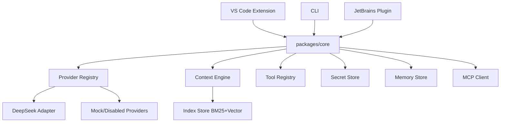

# Architecture

```mermaid
flowchart TD
  VS[VS Code Extension] --> CORE[packages/core]
  CLI[CLI] --> CORE
  JB[JetBrains Plugin] --> CORE
  CORE --> REG[Provider Registry]
  REG --> P1[DeepSeek Adapter]
  REG --> P2[Mock/Disabled Providers]
  CORE --> RET[Context Engine]
  RET --> IDX[Index Store BM25+Vector]
  CORE --> TOOLS[Tool Registry]
  CORE --> SEC[Secret Store]
  CORE --> MEM[Memory Store]
  CORE --> MCP[MCP Client]
```

Core is host-agnostic. UI clients provide approvals, secret storage, and rendering.
