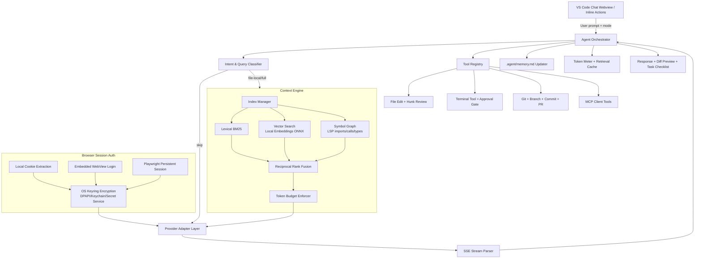

# System Architecture

## Runtime Components

1. **Provider Runtime**: one adapter per provider; all implement a shared `LLMProvider` contract.
2. **Context Runtime**: incremental indexer + hybrid retrieval with strict token budgeting.
3. **Agent Runtime**: planner, tool-calling loop, approvals, and memory persistence.
4. **IDE Shells**: VS Code extension (primary), JetBrains plugin (secondary), CLI (headless).

## Data Boundaries

- **Never store raw cookies in plaintext**; encrypted blobs only in local app storage.
- **No cloud proxy required**; all browser session reuse and indexing are local-first.
- **Retrieval cache is session-scoped** by default to avoid stale context leakage.
