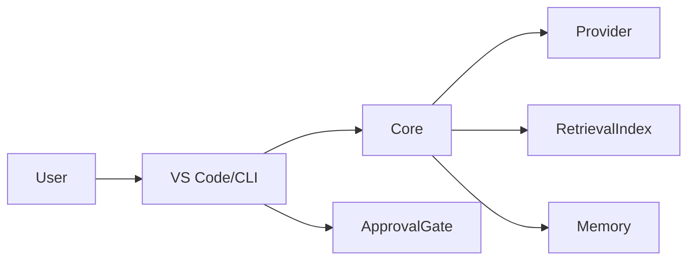

# Security & Risk

## Threat model
- Secrets exposure in logs/config.
- Unsafe command execution.
- Over-broad context exfiltration.

## Secret storage
- Use host-backed secret stores (OS keychain integrations or equivalent).
- Never store provider secrets in plaintext repo files.

## Provider compliance
- Official authentication paths only.
- No browser cookie extraction.
- No private endpoint automation.

## Terminal safeguards
- Risk classification and approval requirements.
- Destructive commands blocked by default.

## Patch model
- Unified diff validation and preview before apply.

## Data flow

## Telemetry
- Disabled by default.
- No code content collection by default.

## Graceful degradation
- Auth failures: show clear error, prompt reconfiguration, switch provider.
- Embedding failures: fallback to BM25 + symbol signals.
- Index failures: continue file-local mode.
